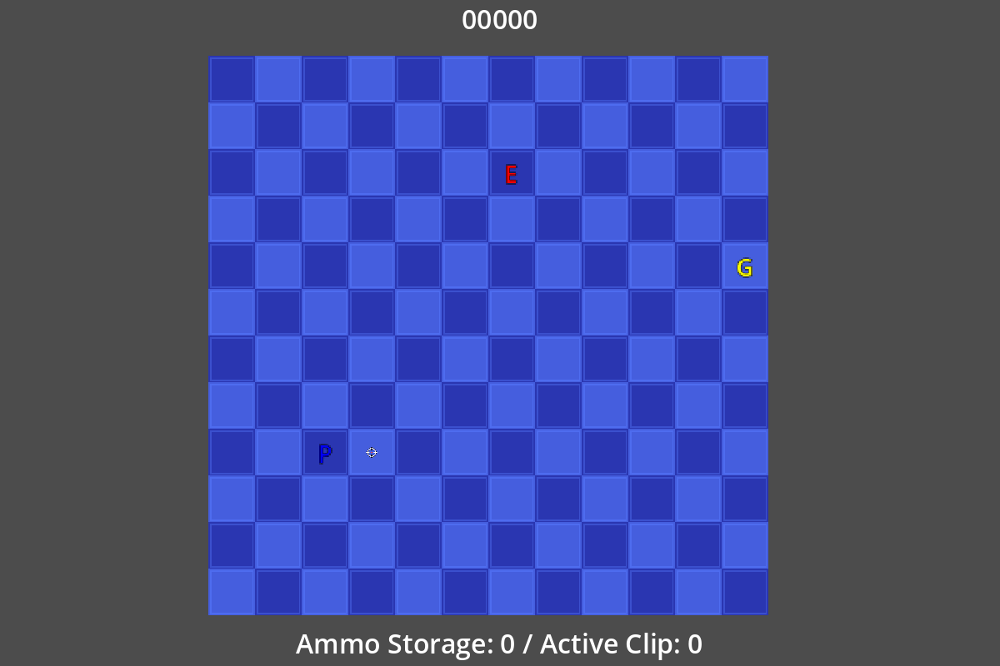

# Magic Gunden Redux

**Collect a trail of gems, line it up with capture zones, and turn a successful drop into ammunition.**

This Godot prototype combines snake-like movement with directional shooting. Every collected gem extends the trail behind you. Release that trail over the changing capture pattern to earn points and ammo; gems released outside it become enemies instead.

The repository is `magic-gunden-redux`; its configured application title is `magic-gunden`. This README describes this checkout, separately from other Magic Gunden versions or hosted builds.



*Actual opening arena captured at 1200×800 on Godot 4.7.2 Forward Plus. The gem capture/drop sequence was not played through during this capture.*

## How to play

1. **Choose a direction with WASD.** Once movement starts, the player continues advancing automatically. A direction directly opposite the currently selected direction is rejected. Initial facing is randomized, so an opposite first key can also be ignored; choose another direction to start.
2. **Collect yellow gems.** Collected gems turn red and follow your path, making a longer trail you must avoid running into.
3. **Align the trail with the capture pattern.** Eligible carried gems turn green while they overlap capture points.
4. **Press E to release the trail.** The drop is processed on the next movement update. Captured gems earn points and ammo; the others turn into enemies.
5. **Aim with the arrow keys and fire with Space.** R requests a reload. Keep enough room to move while preparing the next capture.

Enemy contact, the arena border, or collision with an already collected gem ends the run. The game-over screen shows score, enemies killed, and the recorded gem total, with **Try Again** and **Quit** controls.

## Controls

| Key | Action |
|---|---|
| **W / A / S / D** | Start movement or change travel direction |
| **Arrow keys** | Move the aiming crosshair independently of travel |
| **Space** | Fire if the active clip contains a round |
| **E** | Queue release of the collected gem trail |
| **R** | Start the reload timer |
| **Try Again** | Reload the current game scene after a loss |

Movement uses 32-pixel grid steps, with the player’s movement timer configured at 0.75 seconds. The capture pattern changes on a 15-second timer. These are current prototype settings, not a promise of fixed gameplay timing under every engine/frame condition.

## Why the drop matters

A release separates every carried gem into one of two outcomes:

| Gem at release | Result |
|---|---|
| Overlapping a capture point | Adds to the scored batch and ammunition reserve |
| Outside capture points | Converts into an enemy at that position |

For a batch of captured gems, score awards rise within that batch: 100 for the first, 200 for the second, 300 for the third, and so on. The multiplier starts again for the next release. Enemy kills have their own count; the current scoring code awards points through captured gems.

The ammo system starts empty, uses a **six-round clip**, and reloads automatically when that clip is empty and reserves are available. Manual reload uses the same timer. The HUD separates stored ammo from rounds in the active clip. Projectiles disappear when they hit a gem, so the trail can also obstruct a shot.

## Run from source

The project declares **Godot 4.3** with the **Forward Plus** renderer and GDScript. Its configured window is 1200×800.

```sh
git clone https://github.com/Arrangedgodly/magic-gunden-redux.git
cd magic-gunden-redux
```

1. Import `project.godot` in a compatible Godot editor.
2. Let the editor import the textures and scenes.
3. Press **F5** to run `scenes/game.tscn`.

There is no package-manager installation or web server to start. The tracked project does not include an export preset or automated test suite, and its files do not document a packaged release or public deployment. For this README’s visual check, the unchanged source launched on installed Godot 4.7.2 Forward Plus. This verifies the opening scene in that environment, not the original 4.3 runtime or a complete playthrough.

## Project structure

| Area | Responsibility |
|---|---|
| `scripts/player.gd` | Grid travel, direction changes, trail positions, and queued release |
| `scripts/GemManager.gd` | Gem spawning, collection, following, and capture/conversion results |
| `scripts/drop_zone_manager.gd` | Timed capture-pattern placement |
| `scripts/AmmoManager.gd` | Reserve ammo, six-round clip, reload, and firing permission |
| `scripts/ProjectileManager.gd` | Projectile creation and kill events |
| `scripts/EnemyManager.gd` | Enemy spawning and synchronized movement |
| `scripts/ScoreManager.gd` | Capture-batch scoring and end-of-run statistics |
| `scenes/` | Reusable Godot actors, managers, HUD, and game-over UI |
| `assets/` | Tile textures and crosshair art |

Managers communicate through Godot signals, with the main scene assembling the player, arena, gems, enemies, projectiles, and UI. There is no save system or persistent high-score archive in the current scripts.

## Prototype limits

- Actors use simple letter-based visuals, and no title screen is implemented.
- The “Gems Collected” result is incremented by scored captures, so it should be read as banked gems rather than every pickup touched during the run.
- Shooting is input-triggered; no auto-gun toggle or pause menu is implemented here.
- No audio, controller mapping, or automated regression suite is included in the tracked project.
- Player, gem, and enemy movement relies on timer/tween behavior. Compatibility and collision behavior need actual play testing before distribution.

For manual verification, check movement start and reversal prevention, gem pickup, a successful capture, an out-of-zone release, reload from reserves, shooting, each loss condition, and Try Again. A static screenshot verifies appearance, not the whole loop.

## Licensing

The repository currently has no general `LICENSE` or asset-credit document. Do not assume that public source visibility grants redistribution rights. Add the intended code and asset permissions before publishing a reusable package or binary release.
